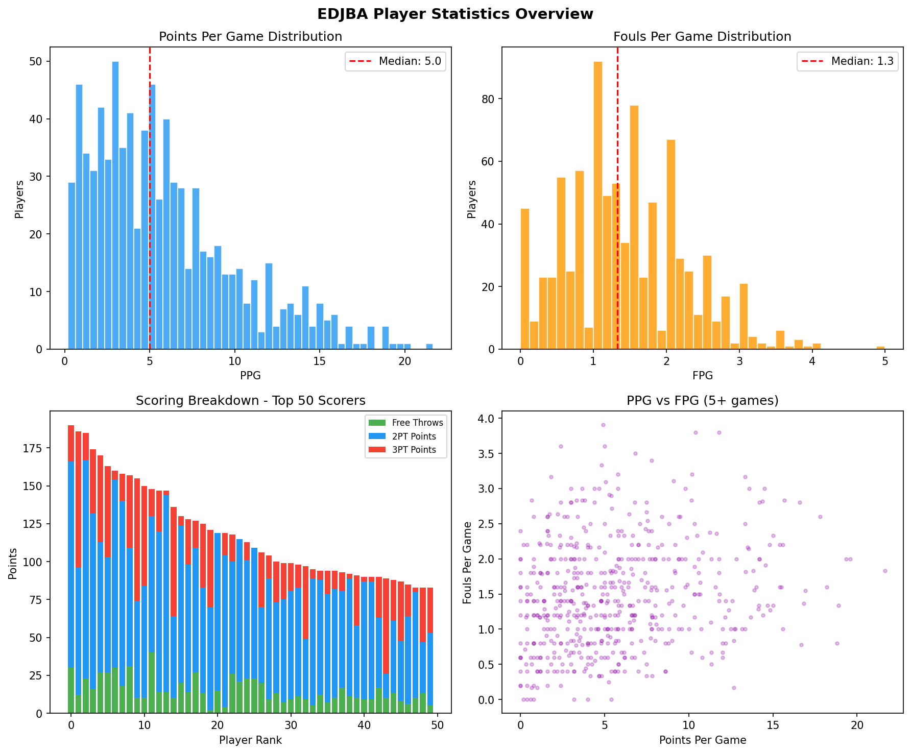
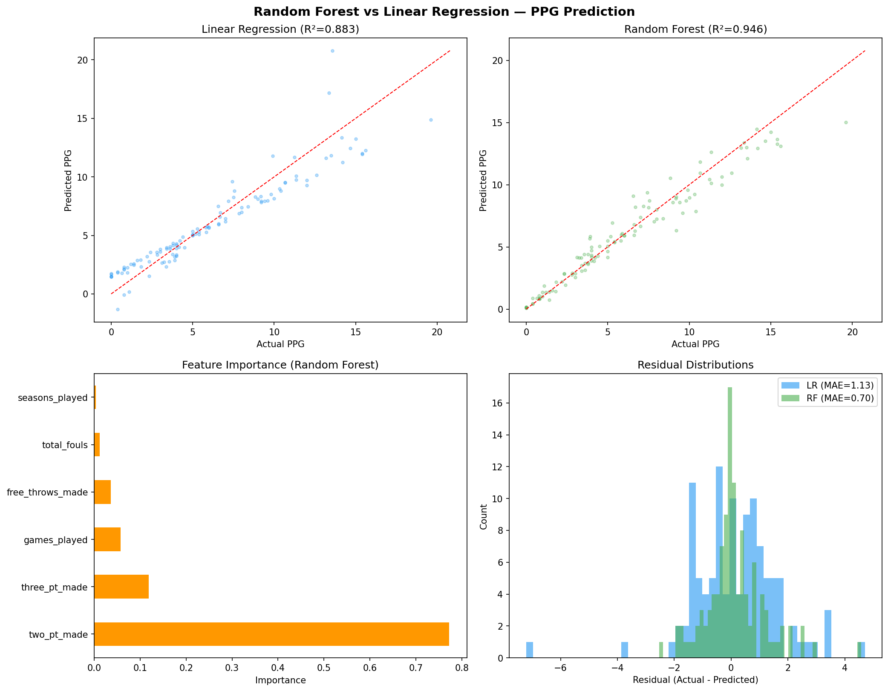
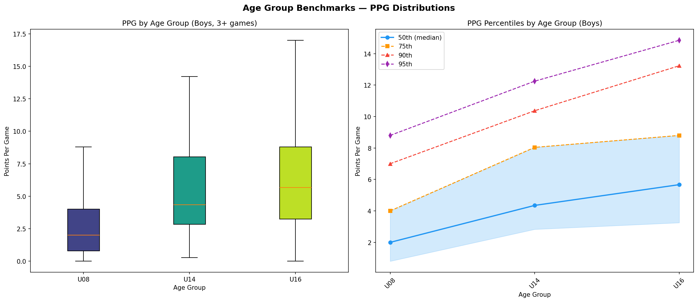
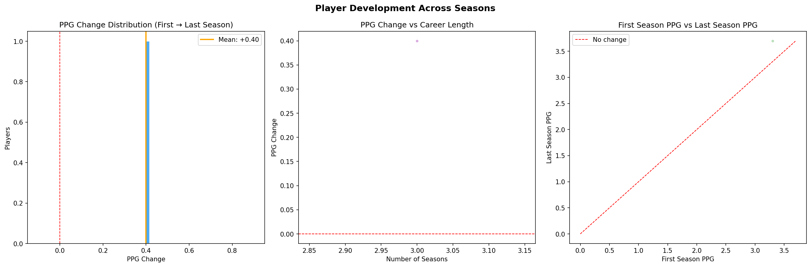

<p align="center">
  
</p>

<h1 align="center">FullCourtVision</h1>
<h3 align="center">Victorian Basketball Analytics</h3>

<p align="center">
  <em>Full court vision — the ability to see everything happening on the court. We do it with data.</em>
</p>

<p align="center">
  
  
  
  
  
  
</p>

<p align="center">
  <strong>Tracking 24,557 players across 46,227 games from 887 organisations in Victorian basketball</strong>
</p>

---

## 📖 What Is This?

FullCourtVision is a data science portfolio project that **reverse-engineers PlayHQ's GraphQL API** to build the most comprehensive analytics platform for Victorian community basketball.

The pipeline scrapes player statistics, game results, team rosters, and organisational data from Basketball Victoria's PlayHQ platform — covering everything from Under-9s through to Senior competitions across 887 registered organisations.

The data feeds into a **SQLite database**, a **Python analysis pipeline** (regression, clustering, random forest), and an **interactive Streamlit dashboard** for exploration.

---

## 📸 Analysis Output

<p align="center">
  
  
</p>
<p align="center">
  
  
</p>
<p align="center">
  
  
</p>

---

## ✨ Features

| Feature | Description |
|---------|-------------|
| **Player Search** | Find any player across 24,557 profiles and view full stat lines |
| **Team Analysis** | Compare team performance across 2,231 teams and 2,628 grades |
| **Leaderboards** | Top scorers, 3PT leaders, and efficiency rankings by age group |
| **Player Comparison** | Side-by-side comparison of any two players |
| **Organisation Directory** | Browse 887 basketball organisations across Victoria |
| **ML Models** | Linear regression (R²=0.989), Random Forest, K-Means clustering |
| **Age Group Benchmarks** | Percentile rankings — what's "good" for U12 vs U16? |

---

## 🔄 Data Pipeline

```
PlayHQ GraphQL API          Node.js Scraper          SQLite Database
┌─────────────────┐    ┌─────────────────────┐    ┌──────────────────┐
│ discoverOrgs     │───▶│ playhq-scraper.js   │───▶│ playhq.db (44MB) │
│ discoverSeasons  │    │ victoria-wide-scrape │    │ 10 tables        │
│ gradePlayerStats │    │ better-sqlite3       │    │ 138K stat lines  │
│ discoverFixture  │    └─────────────────────┘    └────────┬─────────┘
└─────────────────┘                                         │
                                                            ▼
                                              Python Analysis Pipeline
                                         ┌──────────────────────────────┐
                                         │ pandas · scikit-learn · scipy │
                                         │ matplotlib · seaborn · plotly │
                                         └──────────────┬───────────────┘
                                                        ▼
                                              Streamlit Dashboard
                                         ┌──────────────────────────────┐
                                         │ Interactive exploration       │
                                         │ Charts · Tables · Comparisons │
                                         └──────────────────────────────┘
```

**Flow:** The Node.js scraper hits PlayHQ's public GraphQL API (no auth required, just a `tenant: basketball-victoria` header), paginates through organisations → competitions → seasons → grades → player stats, and writes everything to SQLite. Python reads the database, runs statistical models, and generates visualisations. Streamlit serves it all as an interactive web app.

---

## 🏆 Key Findings

| Stat | Value |
|------|-------|
| **Highest season scorer** | Holly Miller — 323 pts in 13 games (24.8 PPG) |
| **Most prolific 3PT shooter** | Craig Whelan — 52 threes in 14 games (3.7 per game) |
| **Average PPG across all players** | 4.0 PPG |
| **Total stat lines tracked** | 138,175 individual player-grade records |
| **Regression model accuracy** | R² = 0.989 (games played → total points) |
| **Player clusters identified** | 3 distinct archetypes via K-Means |

---

## 🛠 Tech Stack

| Component | Technology |
|-----------|-----------|
| **Scraper** | Node.js · better-sqlite3 · PlayHQ GraphQL API |
| **Database** | SQLite (44MB, zero config, portable) |
| **Analysis** | Python 3.12 · pandas · scikit-learn · scipy · matplotlib · seaborn |
| **Dashboard** | Streamlit · Plotly |
| **ML Models** | Linear Regression · Random Forest · K-Means Clustering |
| **Version Control** | Git · GitHub |

---

## 🚀 Getting Started

```bash
# Clone the repo
git clone https://github.com/LittleBennos/FullCourtVision.git
cd FullCourtVision

# --- Scraper (Node.js) ---
cd scraper
npm install
node playhq-scraper.js orgs              # Scrape all organisations
node victoria-wide-scrape.js              # Full Victoria-wide scrape

# --- Analysis (Python) ---
cd ..
pip install -r requirements.txt
python analysis.py                        # Run statistical analysis
python advanced_analysis.py               # ML models & clustering

# --- Dashboard ---
streamlit run streamlit_app.py            # Launch the interactive dashboard
```

### Prerequisites

- **Node.js** 18+ (scraper)
- **Python** 3.10+ (analysis & dashboard)
- No API keys required — PlayHQ's GraphQL endpoint is public

---

## 📁 Project Structure

```
FullCourtVision/
├── scraper/                  # Node.js PlayHQ GraphQL scraper
│   ├── playhq-scraper.js         # Main scraper engine
│   ├── playhq-db.js              # Database schema & helpers
│   ├── victoria-wide-scrape.js   # Full state-wide scraper
│   └── package.json
├── data/
│   └── playhq.db                 # SQLite database (44MB)
├── analysis_output/              # Generated charts & visualisations
├── analysis.py                   # Core statistical analysis
├── advanced_analysis.py          # ML models (RF, clustering)
├── streamlit_app.py              # Interactive Streamlit dashboard
├── requirements.txt              # Python dependencies
├── DATA_DICTIONARY.md            # Database schema documentation
├── ROADMAP.md                    # Project roadmap & future plans
└── docs/
    └── api-notes.md              # PlayHQ API documentation
```

---

## 🗺 Roadmap

See **[ROADMAP.md](ROADMAP.md)** for the full project roadmap, including:

- Phase 1: Expand data collection beyond EDJBA
- Phase 2: Advanced ML models (XGBoost, feature importance)
- Phase 3: Personal analytics tracker
- Phase 4: Full Streamlit dashboard

---

## 📊 Data Dictionary

See **[DATA_DICTIONARY.md](DATA_DICTIONARY.md)** for complete documentation of all database tables and columns.

---

## 📄 License

This project is licensed under the MIT License. See [LICENSE](LICENSE) for details.

---

<p align="center">
  <sub>Built with 🏀 and data by <a href="https://github.com/LittleBennos">LittleBennos</a></sub>
</p>
